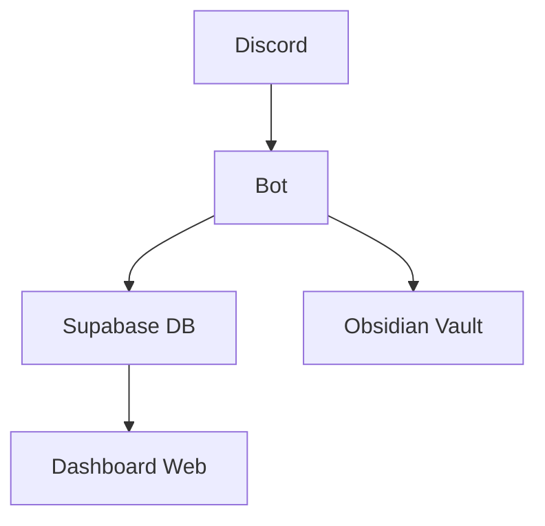

# 🚀 FRONTLINE

**Frontline** é um sistema de inteligência social baseado em Discord, projetado para networking, oportunidades e gestão de membros com visão de fintech.

---

## 🧠 Arquitetura



---

## ⚙️ Stack

* 💬 Discord (Interface)
* 🤖 Bot em Python
* 🧠 Obsidian (Graph + inteligência)
* ⚙️ Supabase (Banco de dados)
* 🌐 Vercel (Dashboard)

---

## 📦 Estrutura

```
frontline/
├── bot/
├── dashboard/
├── templates/
└── obsidian_vault/
```

---

## 🚀 Funcionalidades

* ✅ Criação automática de servidor Discord
* ✅ Sistema de cargos e onboarding
* ✅ Sync automático com Obsidian
* ✅ Armazenamento estruturado no Supabase
* ✅ Dashboard web em tempo real
* ✅ Infra como código (templates)

---

## 🔧 Setup

### 1. Clone o projeto

```bash
git clone https://github.com/seu-usuario/frontline-core.git
cd frontline
```

---

### 2. Configurar variáveis

Crie um `.env`:

```
DISCORD_TOKEN=SEU_TOKEN
SUPABASE_URL=SUA_URL
SUPABASE_KEY=SUA_KEY
```

---

### 3. Instalar dependências

```bash
pip install -r bot/requirements.txt
```

---

### 4. Rodar bot

```bash
python bot/bot.py
```

---

## 🌐 Dashboard

```bash
cd dashboard
npm install
npm run dev
```

---

## 🧠 Obsidian

* Abra a pasta `obsidian_vault`
* Ative o Graph View
* Visualize conexões entre membros e canais

---

## 💣 Comandos do Bot

```
!setup_full
!apply_template
!nuke_server CONFIRMAR
```

---

## 🔐 Segurança

* Nunca suba `.env`
* Use `.gitignore`
* Tokens devem ficar privados

---

## 🚀 Roadmap

* [ ] Sistema de score de membros
* [ ] IA para análise de mensagens
* [ ] Matching de oportunidades
* [ ] Dashboard avançado

---

## 🧠 Filosofia

> Sem valor, sem espaço.

---

## 👑 Autor

**Lexfive**
